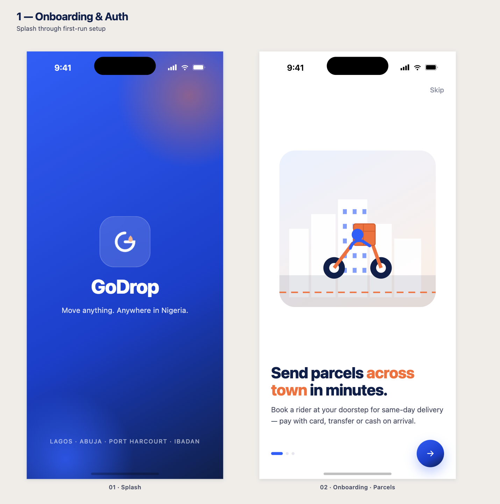
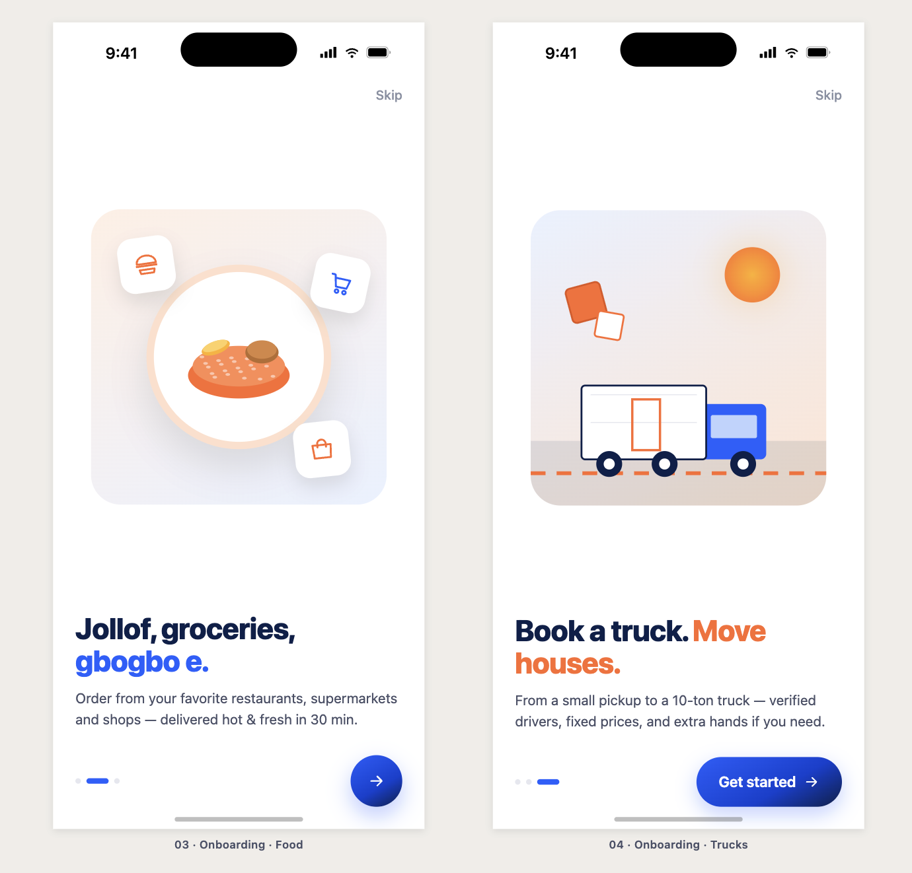
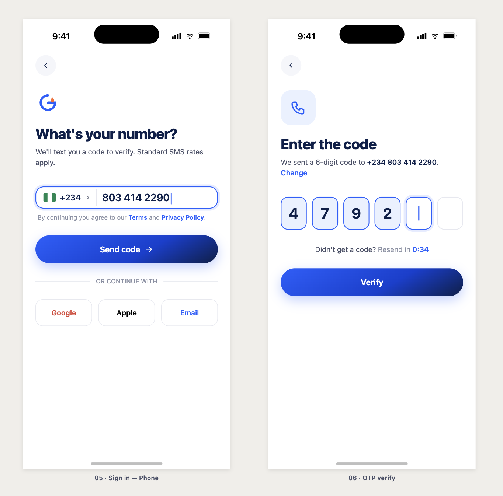
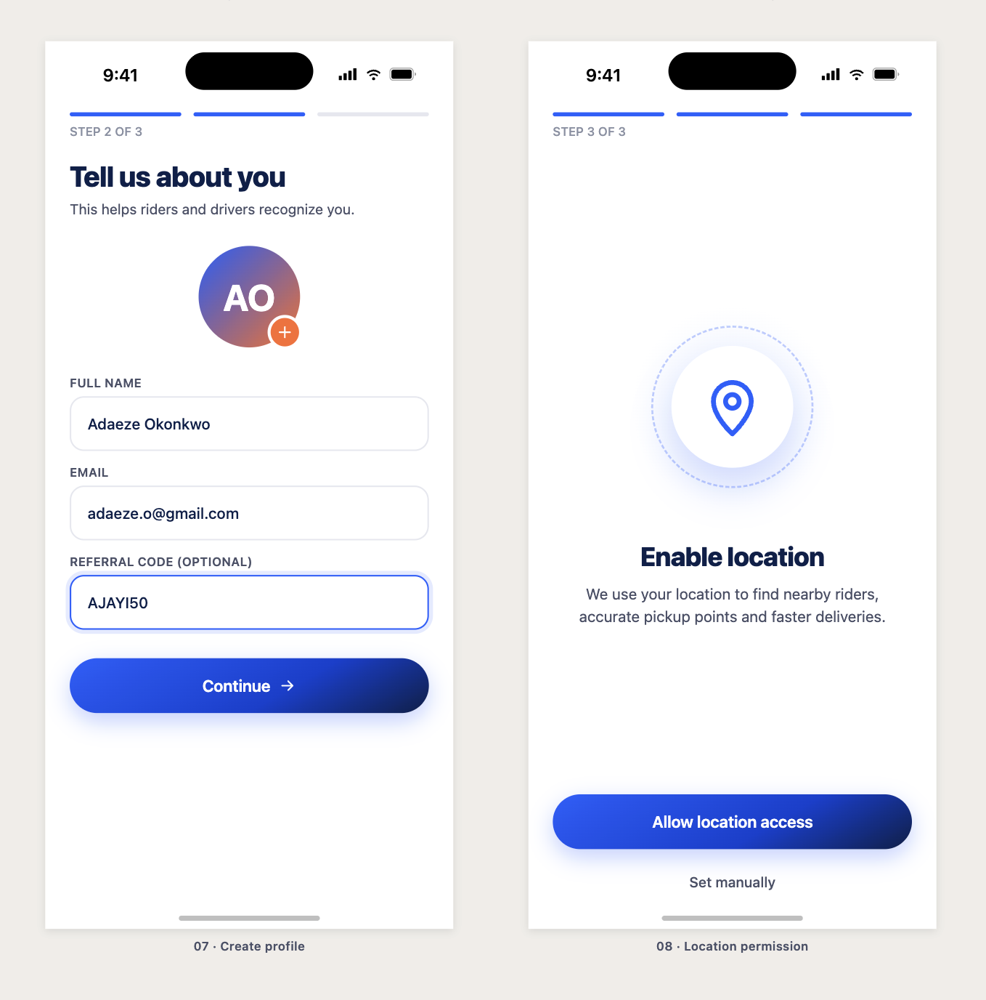
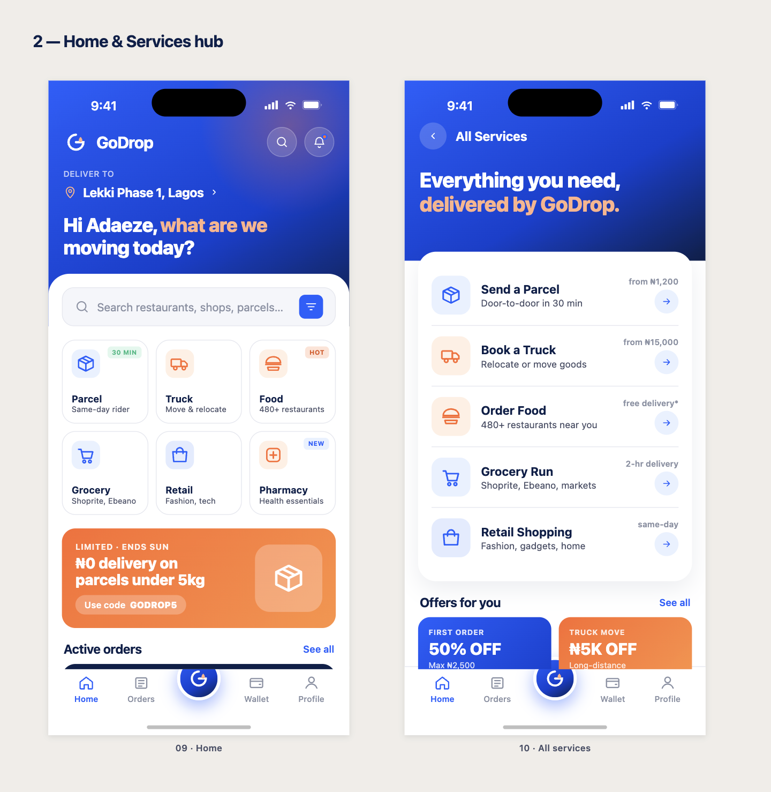
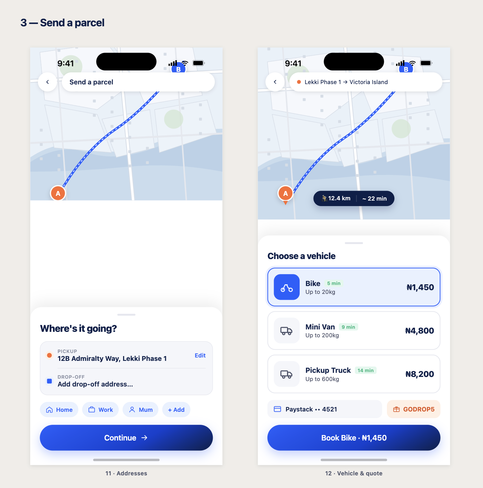
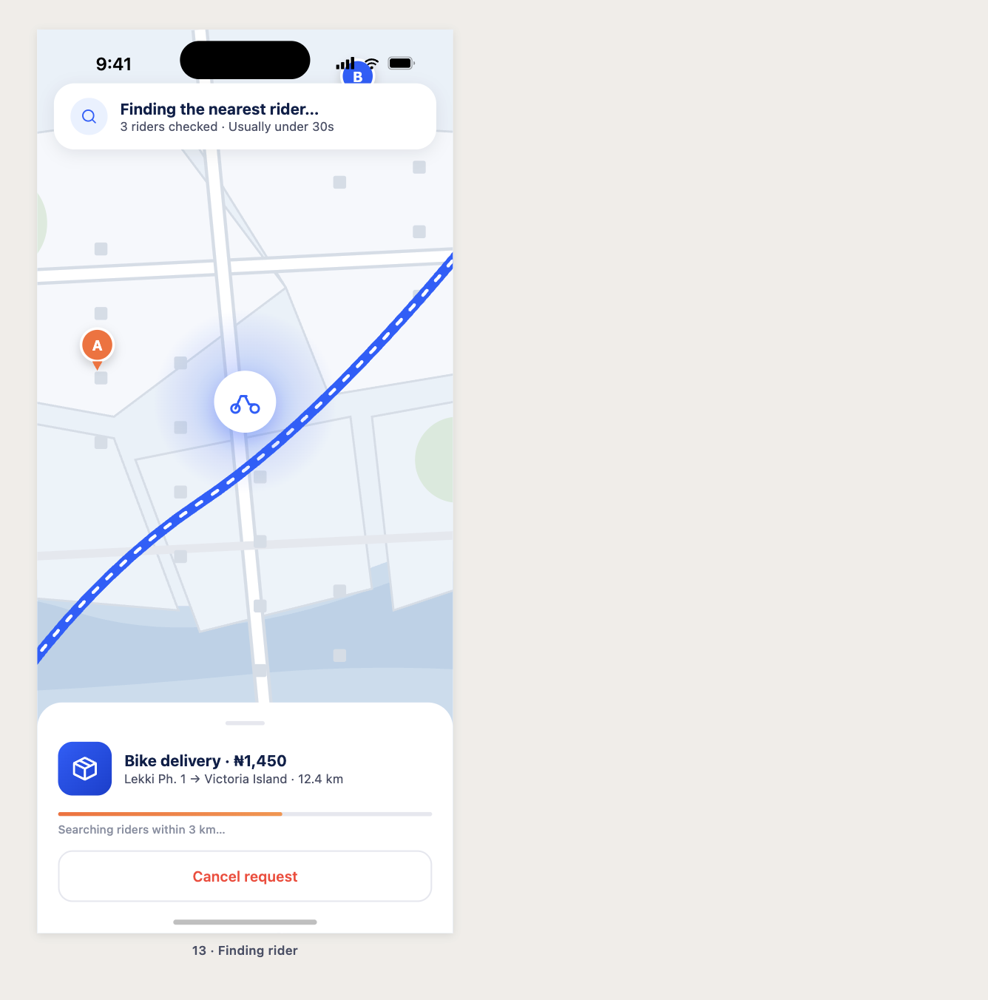
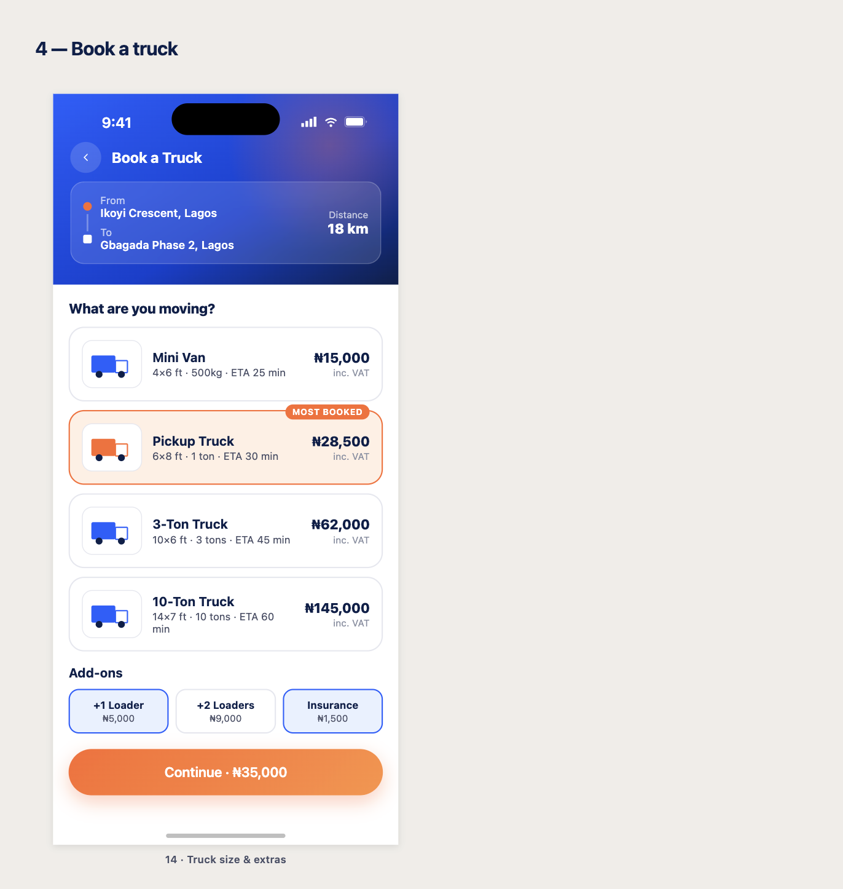

# Godrop Customer App

The customer-facing Flutter app for [Godrop](https://godrop.ng) — Nigeria's on-demand delivery and logistics platform. Customers use it to order food, groceries, retail products, and parcels, book trucks for relocation, and track orders live on a map.

---

## Screenshots

| Onboarding | Home | Parcel | Tracking |
|---|---|---|---|
|  |  |  |  |

| Food | Cart | Truck | Profile |
|---|---|---|---|
|  |  |  |  |

---

## Features

| Feature | Description |
|---|---|
| **Parcel delivery** | Pickup → dropoff address selection with Google Maps autocomplete; bike, mini van, or pickup truck; real-time fare estimate; 30-min ETA |
| **Food ordering** | 480+ restaurant listings; filter by cuisine (Nigerian, Fast Food, Grills, Continental…); menu browser; cart with item quantities; checkout |
| **Grocery delivery** | Supermarket hub (Shoprite, Ebeano, etc.); browse by category |
| **Retail shopping** | Browse retail partner stores; fashion, electronics, beauty, and more |
| **Pharmacy** | Order medications and health products from partner pharmacies |
| **Truck booking** | Schedule a move with Mini Van, Pickup, 3-Ton, or 10-Ton truck; optional loaders; ₦ pricing breakdown before confirmation |
| **Live tracking** | Google Maps screen showing rider position, pickup/dropoff markers, and polyline route; dynamic ETA in minutes |
| **Orders history** | Active and past orders with per-order type icons; delivery rating flow post-completion |
| **Wallet** | Balance display in ₦ (Naira) with USD equivalent; top-up, withdraw, and transaction history |
| **Profile** | Name, phone, saved addresses, notifications, and app settings |
| **Auth flow** | Phone number entry (Nigerian flag 🇳🇬, auto +234), OTP verification, profile creation, and one-time location permission |

---

## Tech Stack

| Layer | Choice |
|---|---|
| Framework | Flutter (latest stable) + Dart ≥ 3.0 |
| State management | `flutter_bloc` — `Cubit` for simple state, `Bloc` for event-driven flows |
| Navigation | `go_router` — declarative routes with typed extras |
| Maps & location | `google_maps_flutter` + `google_places_flutter` + `geolocator` |
| HTTP | `http` package |
| Local storage | `hive` + `hive_flutter` (order persistence) |
| Fonts | `google_fonts` (Inter) |
| Phone input | `intl_phone_number_input` |
| Image picking | `image_picker` |
| Splash / icons | `flutter_native_splash` + `flutter_launcher_icons` |

---

## Project Structure

```
lib/
├── main_customer.dart          # App entry point
├── main.dart                   # (alias)
├── app/
│   ├── customer_app.dart       # MaterialApp setup
│   ├── router.dart             # go_router config — all named routes
│   └── theme.dart              # GodropColors, GodropTheme, GodropTextStyles
├── features/
│   ├── splash/                 # Splash screen with gradient + logo
│   ├── onboarding/             # 3-slide intro carousel
│   ├── auth/
│   │   ├── phone_screen.dart   # Phone entry + NG flag
│   │   ├── otp_screen.dart     # 6-digit OTP verification
│   │   ├── create_profile_screen.dart
│   │   └── location_screen.dart
│   ├── home/
│   │   ├── home_screen.dart    # Category grid + active order banner
│   │   └── all_services_screen.dart
│   ├── parcel/
│   │   ├── parcel_addresses_screen.dart  # Map-based pickup/dropoff picker
│   │   ├── parcel_vehicle_screen.dart    # Vehicle + fare selection
│   │   └── finding_rider_screen.dart     # Animated rider-matching screen
│   ├── food/
│   │   ├── restaurants_screen.dart       # (alias → partners)
│   │   ├── restaurant_menu_screen.dart   # (alias → partner menu)
│   │   └── cart_checkout_screen.dart     # Cart summary + place order
│   ├── grocery/
│   │   └── grocery_hub_screen.dart
│   ├── partners/
│   │   ├── partners_screen.dart          # Filterable partner listing (food/grocery/retail/pharmacy)
│   │   └── partner_menu_screen.dart      # Menu grid + add to cart
│   ├── tracking/
│   │   └── live_tracking_screen.dart     # Google Maps + rider card + ETA
│   ├── truck/
│   │   ├── truck_booking_screen.dart     # Booking wizard
│   │   └── truck_confirmation_screen.dart
│   ├── orders/
│   │   ├── orders_screen.dart
│   │   └── delivered_rate_screen.dart    # Post-delivery rating
│   └── profile/
│       ├── profile_screen.dart
│       ├── wallet_screen.dart
│       ├── settings_screen.dart
│       └── notifications_screen.dart
└── shared/
    ├── api/
    │   └── places_service.dart           # Google Places autocomplete wrapper
    ├── services/
    │   └── user_prefs.dart               # Hive-backed user preferences
    └── widgets/
        ├── main_shell.dart               # Bottom-nav shell (Home / Orders / Wallet / Profile)
        ├── godrop_button.dart            # Primary CTA button
        ├── animated_entrance.dart        # Slide-in entrance animation
        └── fake_map.dart                 # Static map placeholder
```

---

## Navigation

All navigation uses `go_router`. Routes are defined in `lib/app/router.dart`.

| Path | Screen | Transition |
|---|---|---|
| `/splash` | SplashScreen | fade |
| `/onboarding` | OnboardingScreen | fade |
| `/auth/phone` | PhoneScreen | fade-up |
| `/auth/otp?phone=` | OtpScreen | slide |
| `/auth/profile` | CreateProfileScreen | slide |
| `/auth/location` | LocationScreen | slide |
| `/home` | HomeScreen | shell tab |
| `/orders` | OrdersScreen | shell tab |
| `/wallet` | WalletScreen | shell tab |
| `/profile` | ProfileScreen | shell tab |
| `/parcel/addresses` | ParcelAddressesScreen | slide |
| `/parcel/vehicle` | ParcelVehicleScreen | slide |
| `/parcel/finding` | FindingRiderScreen | fade-up |
| `/truck` | TruckBookingScreen | slide |
| `/truck/confirmation` | TruckConfirmationScreen | fade-up |
| `/food/restaurants` | PartnersScreen (food) | slide |
| `/food/restaurant` | PartnerMenuScreen | slide |
| `/grocery/stores` | PartnersScreen (grocery) | slide |
| `/retail/stores` | PartnersScreen (retail) | slide |
| `/pharmacy/stores` | PartnersScreen (pharmacy) | slide |
| `/grocery` | GroceryHubScreen | slide |
| `/tracking` | LiveTrackingScreen | fade-up |
| `/orders/delivered` | DeliveredRateScreen | fade-up |
| `/services` | AllServicesScreen | slide |
| `/notifications` | NotificationsScreen | slide |
| `/settings` | SettingsScreen | slide |

---

## Brand & Design

**Colors**

| Token | Hex | Use |
|---|---|---|
| `ink` | `#0B1F4A` | Headings, primary body text |
| `slate` | `#4A5068` | Descriptions, subtitles |
| `mute` | `#8A90A3` | Timestamps, hints, metadata |
| `blue` | `#1E5FFF` | CTAs, active tabs, links |
| `orange` | `#FF6A2C` | Prices, promo badges, accents |
| `white` | `#FFFFFF` | Text on dark/gradient headers |
| `background` | `#F5F4F2` | Scaffold background |

**Typography:** Inter via `google_fonts`, full Material 3 text theme (`displayLarge` → `labelSmall`).

**Gradients:**
- `blueGradient` — `#2563EB` → `#0F2680` (wallet header, prominent cards)
- `splashGradient` — `#1A3CCC` → `#0D1F6E` (splash screen)

---

## Local Development

**Prerequisites**

- Flutter SDK (latest stable) — `flutter --version`
- Android Studio / Xcode (for emulators)
- Google Maps API key (set in `android/app/src/main/AndroidManifest.xml` and `ios/Runner/AppDelegate.swift`)

**Setup**

```bash
# 1. Install dependencies
flutter pub get

# 2. Run on Android emulator (recommended — most Nigerian users are on Android)
flutter run -t lib/main_customer.dart

# 3. Run on iOS simulator
flutter run -t lib/main_customer.dart
```

**Build**

```bash
# Android APK (release)
flutter build apk -t lib/main_customer.dart

# Android App Bundle
flutter build appbundle -t lib/main_customer.dart

# iOS IPA
flutter build ipa -t lib/main_customer.dart
```

**Regenerate splash / icons** (after changing assets)

```bash
dart run flutter_native_splash:create
dart run flutter_launcher_icons
```

---

## API

| Environment | Base URL |
|---|---|
| Development | `http://10.0.2.2:4000/api/v1` (Android emulator → localhost) |
| Production | `https://api.godrop.ng/v1` |

Authentication: `Authorization: Bearer <token>` header on all protected endpoints.

The full API contract lives at `apps/backend/openapi.yaml` in the monorepo root.

---

## Nigerian Market Notes

- **Currency:** All monetary values stored as Kobo (integer); displayed as Naira with `₦` symbol (e.g. `₦1,450.00`).
- **Phone numbers:** E.164 format (`+234XXXXXXXXXX`). UI shows Nigerian flag and auto-prepends `+234`.
- **Payments:** Paystack integration (not Stripe). Cash on delivery is a valid option.
- **Maps:** Lagos-centric defaults (Ikeja, VI, Lekki, Yaba, Surulere as suggested areas). Falls back to `LatLng(6.5244, 3.3792)` when location permission is denied.
- **ETAs:** Shown in minutes, not absolute clock time — Lagos traffic makes exact times unreliable.
- **Images:** Lazy-loaded with caching to handle low-bandwidth conditions.

---

## Bloc Architecture

State management follows strict flutter_bloc conventions:

- One `Bloc` or `Cubit` per feature screen / logical unit — no god blocs.
- `Cubit` for simple one-shot or toggle state (e.g. `CartCubit`, `OrderCubit`).
- `Bloc` for screens driven by multiple distinct events.
- State classes live in `features/<feature>/bloc/` alongside their Bloc.
- Widgets dispatch events only — never emit state directly.

---

## Part of the Godrop Monorepo

This app is one of four apps in the `godrop/` monorepo:

```
godrop/
├── apps/
│   ├── backend/      Node.js + Express API
│   ├── mobile/       Flutter apps (customer + rider)
│   │   └── Customer/ ← you are here
│   ├── landing/      Next.js marketing site
│   └── dashboard/    Next.js ops dashboard
└── packages/
    └── shared-types/ TypeScript types shared across JS/TS apps
```
